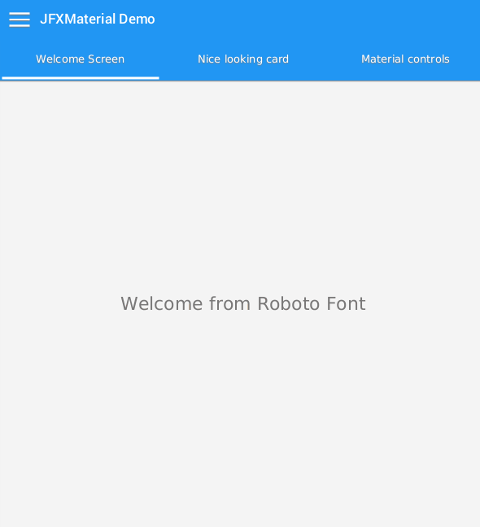

# JFXMaterial

JFXMaterial is a set of JavaFX controls based on Google material design guidelines.

The library contains: 
  - ActionBar with tabs
  - DrawerLayout
  - Card with change content ripple animation
  - ToggleButton, RadioButton, InputText, Button, MaterialText (Roboto font)

#### Demonstration:

